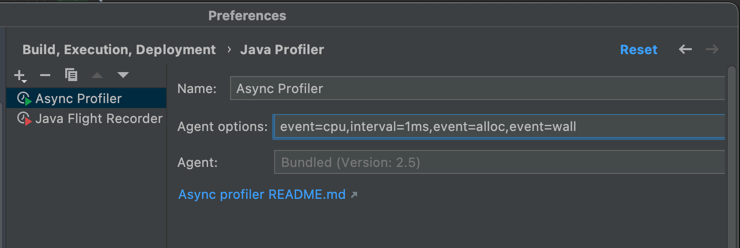
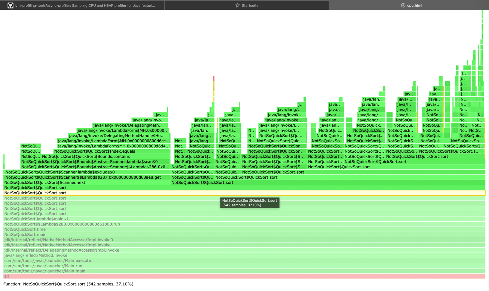
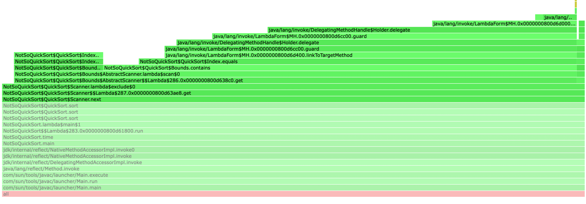
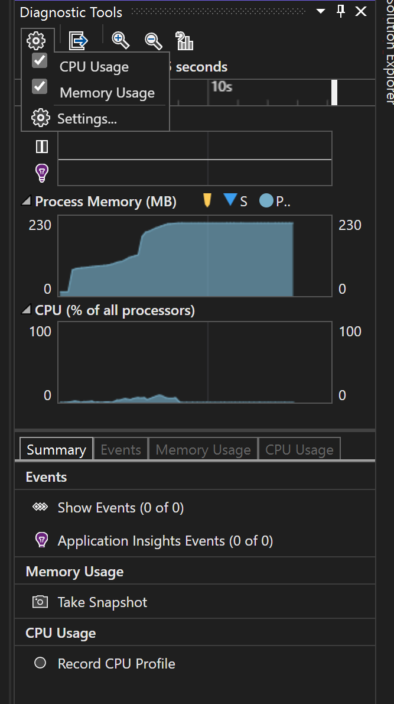

#BAP Aufgabe Part 1:
##intelliJ Ultimate Profiler, Java

###Configuration:

Settings/Preferences -> Build/Deployment -> Profiler

cpu = cpu, alloc = memory, wall = time (clock)
interval = interval

Download current release: 

https://github.com/jvm-profiling-tools/async-profiler

(In my Case for arm/macOS)

##Approach

I tried to run the program with var size=100000
and in my initial thoughts the problem has to be on the cpu side
because it´s mostly calculations, so I extracted the downloaded file, put it
in my project folder and run the following command to see my cpu usage:

java -agentpath:/Users/dawud/Documents/profiler/async-profiler-2.7-macos/build/libasyncProfiler.so=start,event=cpu,file=cpu.html NotSoQuickSort.java

open the cpu.html file and have the following results

My 'investigation' shows that the sort method is called very often and the cpu
usage of Scanner.next -> Scanner.exclude is very high, in this the profiler almost 
everytime show that a lambda was used, after finding this post on Stack
overflow: https://stackoverflow.com/questions/34585444/java-lambdas-20-times-slower-than-anonymous-classes
I came to the conclusion that the high usage of lambda´s may have an impact on performance though I did not try 
replacing the code with something else

#Part 2
##Visual Studio Code, C#

Profiling with Visual Studio Code is very easy, just start any 

###Configuration:

Click on the small gear and check CPU Usage and Memory Usage, then record the CPU profile or browse the different options to get more details, it is pretty self-explanatory.

For more documentation on this topic I left a link in useful sources because I did not want to copy and paste an already better version of my try to document the visual studio profiler.

#Useful sources:
(Java)https://www.jetbrains.com/help/idea/async-profiler.html

(C#)https://docs.microsoft.com/en-us/visualstudio/profiling/profiling-feature-tour?view=vs-2022